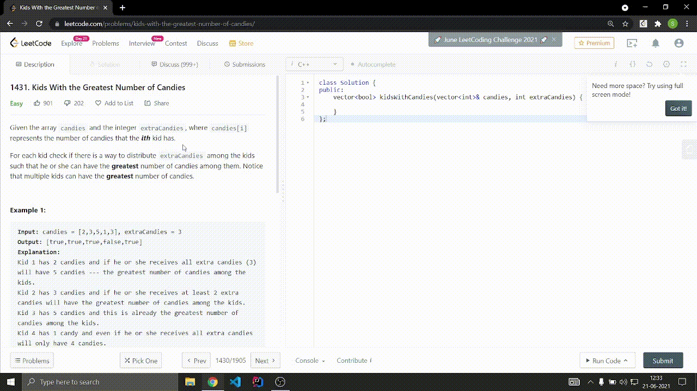

# Constraints-Blocker-Chrome-Extension

 

Chrome Extension will hide the constraints of the given problem as constraints reveal major hints to solve the given problem. This helps to simulate real interview experience practice as in an interview you won't be revealed the constraints. The constraints give major hints of how to solve the problem. For example, if n<=20 then it's obvious the problem will be solved using some brute-force approach. 

## Demo  

## Supported Platforms

- [Leetcode](https://leetcode.com)
- [Binarysearch](https://binarysearch.com)
- [Codechef](https://codechef.com)

## Contributing
Pull requests are welcome. For major changes, please open an issue first to discuss what you would like to change.
